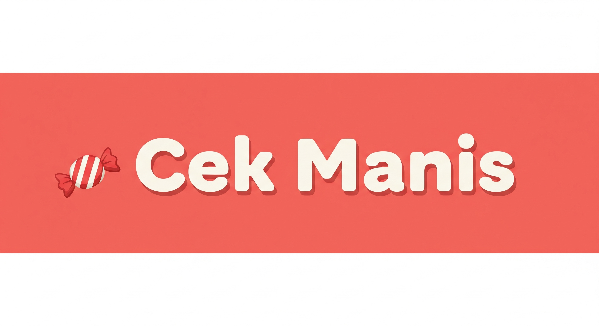

  


  <summary>Table of Contents</summary>
  <ol>
    <li><a href="#project-overview">Project Overview</a></li>
    <li><a href="#feature">Feature</a></li>
    <li>
      <a href="#getting-started">Getting Started</a>
      <ul>
        <li><a href="#installation">Installation</a></li>
        <li><a href="#running">Running</a></li>
      </ul>
    </li>
    <li><a href="#demo-and-resources">Demo and Resources</a></li>
    <li><a href="#special-thanks">Special Thanks</a></li>
    <li><a href="#disclaimer">Disclaimer </a></li>
  </ol>


## 🔎Project Overview

Cek Manis is a Generative AI prototype designed as a public health tool to address Malaysia's alarming rates of obesity and diabetes which are the highest in ASEAN. The project aligns directly with the Health Ministry's mandatory Nutri-Grade Malaysia 
labelling system and the national __'WAR ON SUGAR’__ campaign.

### 🏆Competition Track   
Embedded LLM Track - Generative AI for Malaysian Industries with JamAI Base.

### 💡Problem Statement 
Malaysia has a serious health problem, leading the ASEAN region in rates of obesity and diabetes. This is mainly happening because people are consuming too much sugar every day without even realizing it and they are finding it difficult to choose healthy food options consistently.  

### 🎯Objectives  
The main objectives are to support the Health Ministry's new Nutri-Grade policy by providing clear sugar transparency for all beverages.
- Provide clear sugar transparency for all types of beverages with just a single tap.
- Track daily sugar and saturated fat intake and forecast future health outcomes.
- Uses AI chatbot and AI scanner to improve users' convenience.
---
## 📝Feature
1. **Daily tracking on sugar and saturated fat**:
   - Provides a real-time tracker for the user's consumption of Sugar and Saturated Fat
   - Displaying the amount consumed and the remaining Daily and Monthly allowances for each.

3. **"Potong Kaki" Risk Predictor**:
   - Calculates an individual's potential health risk based on their Age, Weight (kg), and Height (cm) to determine a BMI Factor
   - Predict future weight changes and comparing the outcome to a healthy baseline.

5. **Scan Nutrition Label**:
   - Allows users to scan or upload an image of a drink's nutrition label to automatically extract and track its nutritional data.
7. **Scan the Fresh Prepared Drinks**:
   - Allow users to scan or upload an image of a freshly prepared or non-packaged beverages to a analyze the nutritional information of beverage.
9. **Scan the Beverage Menu**:
   - Allows users to scan or upload a image of a restaurant menus to analyze the nutritional information of beverage.
10. **Manual Input**:
    - Allow users to manually input the name of a drink and then select the sugar level percentage to analyze its sugar content without needing to take a photo.
12. **AI Chatbot**:
    - The JamAI Chatbot acts as the user's personal health assistant, offering two personas, Prof. Manis and Mak Cik Manis to provide guidance and support on health and dietary matters.

### English and Bahasa Melayu are supported.
---
## 🚀Getting Started
> [!NOTE]  
> We highly recommended to develop the project using Python 3.13.0 or later in the Visual Studio Code (VS Code).

### Installation
1. Git Clone
  ```
  git clone https://github.com/tanpeishing123/hackathon2025.git
  ```
2. Create a virtual environment in VS code:  
  ```
  py -m venv venv
  ```
3. Install the requirement.txt:
  ```
  pip install -r requirements.txt
  ```

4. Download the `proj_9a8190b20789a318daf028ae.parquet` from [JamAI](JamAI) file  
5. Import the project and get the Project ID and JamAI API Key from [JamAI Base](https://www.jamaibase.com/)  
6. In VS Code, rename the file `secrets.toml.example` to `secrets.toml` in`.streamlit`.
7. Enter your project ID and JamAI API Key inside `secrets.toml`  

---
### Running
8. Run
  ```
  streamlit run "Home.py"
  ```
---

## 🎥Demo and Resources

### Demo Video:[Video](https://drive.google.com/file/d/1OU2xREmFAbj7BvUoqywbb9lh0KiaNWSn/view?usp=sharing)   
### Slides: [Cek Manis](https://www.canva.com/design/DAG5y2ExALo/Nac_p8XBLmmMn3Xilswy9g/edit)
---
## 👤Special Thanks
Hi, We are from Team Get EXP.  
We would like to extend our gratitude to:

- CodeFest committee and sponsorship for providing the opportunity to work on this project.
- Our team members for commiting and collaborating throughout the project.
   - [Choong Zhuo Lin](https://github.com/25006675-png)
   - [Goh Zhi Xuan](https://github.com/25006285-byte)
   - [Tan Pei Shing](https://github.com/tanpeishing123)
   - [Yee Wing Yong](https://github.com/sayap888)
   - [Lee Kai Hong](https://github.com/HappySkyLee)
---
## 📌Disclaimer  
> [!Important]
> The data and predictions provided by Cek Manis are generated for **educational** and **awareness** purposes only.

<div align="center">
  <strong>Made by Team Get EXP</strong>
  <br>
  <strong><em>© CodeFest 2025<em>
</div>
